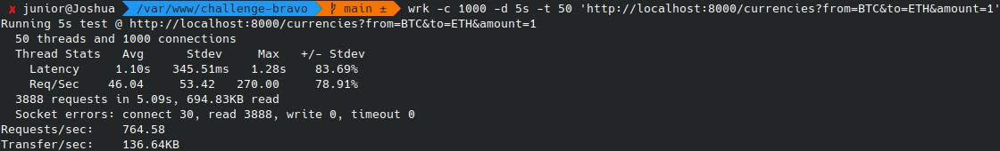

#  Hurb - Challenge Bravo

## Indíce
* [Sobre](#about)
* [Requisitos](#requirements)
* [Docker Setup](#docker-setup)
* [Setup](#setup)
* [Setup de Sincronização](#sync-setup)
* [Funcionamento](#work)
    * [Converter Moeda](#work-currency-convert)
    * [Login](#work-login)
    * [Adicionar Moeda](#work-currency-add)
    * [Remover Moeda](#work-currency-remove)
* [Comandos do Composer](#composer-commands)
* [Estrutura do Projeto](#filesystem)
* [Endpoints](#endpoints)
* [Teste de Estresse](#stress-test)
* [Informações Adicionais](#details)

<a name="about"></a>
## Sobre

Este projeto foi criado através do desafio proposto pelo hurb, seu objetivo é fazer conversão monetária entre duas moedas.

Moedas iniciais suportadas:
- USD
- BRL
- EUR
- BTC
- ETH

<a name="requirements"></a>
## Requisitos
- PHP 7.3 ou mais recente
- php-curl extension
- php-sqlite extension
- [composer](https://getcomposer.org/doc/00-intro.md)
- [docker-compose](https://docs.docker.com/compose/install) (caso use container)

<a name="docker-setup"></a>
## Docker Setup

Configure o arquivo .env seguindo as configurações do .env.example (para funcionar, basta copiar e colar o conteúdo).

Suba o container:
```sh
composer docker
```

Instale as dependências e gere o banco inicial:
```sh
docker-compose run webserver composer install && composer migrate
```

Dê as permissões necessárias no banco criado, para que o apache possa escrever:
```sh
chmod 666 database/hurb-challenge.db
```

Configure o arquivo .env com base no .env.example (opcional).

A aplicação estará disponível no endereço: http://localhost:8000.

<a name="setup"></a>
## Setup

Instale as dependências:

```sh 
composer install
```

Configure o arquivo .env: *
```sh
nano .env
```
<sub>*Se o arquivo não for criado automaticamente depois do composer install, faça uma cópia do .env.example.</sub>

Rode as migrations e seeds:
```sh
composer migrate
```

Inicie a aplicação:
```sh
composer start
```

A aplicação estará disponível no endereço: http://localhost:8000.

<a name="sync-setup"></a>
## Setup de Sincronização


Crie um cron para sincronizar as taxas de câmbio de tempos em tempos:
```sh
crontab -e
```

Configure um cron de hora em hora no editor:

#### Projeto rodando no Docker:
```sh
0 * * * * cd /caminho/do/projeto && docker-compose exec webserver composer sync
```
#### Projeto rodando Local:
```sh
0 * * * * cd /caminho/do/projeto && composer sync >/dev/null 2>&1
```
<sub>Dependendo das configurações, será necessário definir o caminho completo dos comandos.</sub>

<a name="work"></a>
## Funcionamento

<a name="work-currency-convert"></a>
### Converter Moeda
Requisição para realizar a conversão entre 2 moedas:
- **from**: Moeda de origem.
- **to**: Moeda para qual o valor será convertido.
- **amount**: Valor da moeda de origem que será convertido.
```sh
curl 'http://localhost:8000/currencies?from=USD&to=BRL&amount=30'
```

<a name="work-login"></a>
### Login
Requisição para obter um token de acesso que permite usar as rotas para adicionar e remover moedas:
- **username**: usuário cadastrado no banco (padrão do .env.example é: **admin**).
- **password**: senha do usuário (padrão do .env.example é: **HuRbCh4113ng3#bR4v0**).

<sub>OBS.: Se alguma dessas informações for mudada no .env, será necessário mudar na requisição também.</sub>
```sh
curl 'http://localhost:8000/login' -d 'username=admin&password=HuRbCh4113ng3#bR4v0'
```

<a name="work-currency-add"></a>
### Adicionar Moeda
Requisição para adicionar moeda:
- **currency**: Moeda a ser adicionada.
- **usd_value**: Valor da moeda equivalente a 1 dólar americano (USD).
- **{token}**: Token gerado no endpoint /login.
```sh
curl 'http://localhost:8000/currencies' -X 'POST' -d 'currency=CAD&usd_value=1.26' -H 'Authorization: Bearer {token}'
```

<a name="work-currency-remove"></a>
### Remover Moeda
Requisição para remover moeda:
- **{currency}**: Código da moeda a ser removida.
- **{token}**: Token gerado no endpoint /login.
```sh
curl 'http://localhost:8000/currencies/{currency}' -X 'DELETE' -H 'Authorization: Bearer {token}'
```

<a name="composer-commands"></a>
## Comandos do Composer

Rodar testes:
```sh
composer tests
```

Iniciar projeto utilizando php-cli:
```sh
composer start
```

Configurar/Limpar banco:
```sh
composer migrate
```

Sincronizar taxas de câmbio:
```sh
composer sync
```

Iniciar container:
```sh
composer docker
```

<a name="filesystem"></a>
## Estrutura do Projeto
```
├── database - Arquivos de banco de dados.
│   ├── migrations - Scripts para criar as tabelas do banco de dados.
│   └── seeds - Scripts para criar registros iniciais no banco de dados.
│
├── docker-compose - Arquivos de configuração do container.
│   └── apache2 - Arquivos de configuração do apache2.
│
├── public - Pasta pública.
│   └── docs - Arquivos com a documentação da API.
│
├── src - Arquivos do sistema.
│   ├── Controllers - Controladores do sistema.
│   ├── Models - Modelos do sistema.
│   ├── Repositories - Repositórios do sistema.
│   ├── routes - Rotas do sistema.
│   └── Services - Classes de serviços para auxiliar na lógica extra.
│
├── sync - Arquivos de sincronização.
|
├── tests - Testes do sistema.
│   ├── API - Testes dos endpoints da API.
│   └── Unit - Testes unitários com componentes do sistema.
```

<a name="endpoints"></a>
## Endpoints

```
(doc)GET / (HTML)
POST /login
GET /currencies
POST /currencies
DELETE /currencies/{currency}
```

<a name="stress-test"></a>
## Teste de Estresse



<a name="details"></a>
## Informações adicionais


#### A atualização das taxas de câmbio está acontecendo de hora em hora. Não é possível aumentar, pois a API utilizada para consulta é gratuita, e só disponibiliza 1000 requisições por mês. O cálculo feito foi: 1000/31 = 32 requisições por dia (arredondando pra baixo), então 24 requisições por dia seria um número seguro.
---

#### O sistema de autenticação está usando JWT (Json Web Token), os tokens são gerados na rota /login.
---